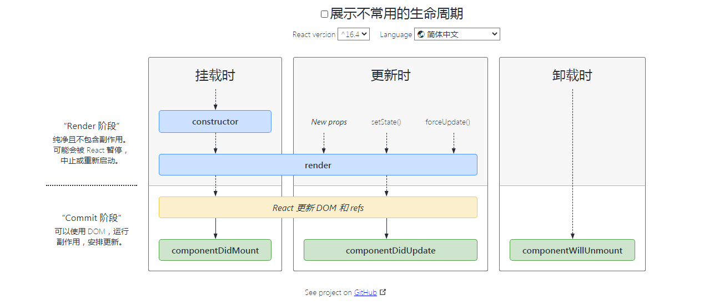
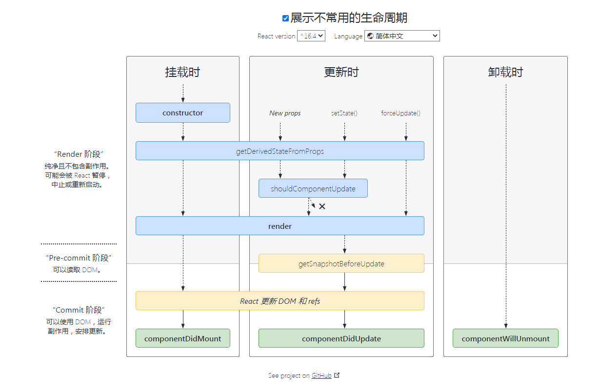

::: tip
React扫盲攻略
::: 
### 1、setState 是异步还是同步？
+ 合成事件中是异步
+ 钩子函数中的是异步
+ 原生事件中是同步
+ setTimeout中是同步

### 3、组件生命周期






+ 挂载阶段
  + constructor
  + getDeriveStateFromProps
  + render
  + componentDidMount
+ 更新阶段
  + getDeriveStateFromProps
  + shouldComponentUpdate
  + render
  + getSnahotBeforeUpdate
  + ComponentDidUpdate
+ 卸载阶段
  + ComponentWillUnmount

[点击查看生命周期](https://projects.wojtekmaj.pl/react-lifecycle-methods-diagram/)

### 3、useEffect(fn, []) 和 componentDidMount 有什么差异？
+ useEffect 会捕获 props 和 state。所以即便在回调函数里，你拿到的还是初始的 props 和 state。如果想得到“最新”的值，可以使用 ref。

### 10、什么是 Portals？

Portal 提供了一种将子节点渲染到存在于父组件以外的 DOM 节点的优秀的方案。


### 11、React 组件间有那些通信方式?

### 父组件向子组件通信

1、 通过 props 传递

### 子组件向父组件通信

1、 主动调用通过 props 传过来的方法，并将想要传递的信息，作为参数，传递到父组件的作用域中

### 跨层级通信

1、 使用 react 自带的 `Context` 进行通信，`createContext` 创建上下文， `useContext` 使用上下文。

### 12、React 父组件如何调用子组件中的方法？

1、如果是在方法组件中调用子组件（`>= react@16.8`），可以使用 `useRef` 和 `useImperativeHandle`:

```jsx
const { forwardRef, useRef, useImperativeHandle } = React;

const Child = forwardRef((props, ref) => {
  useImperativeHandle(ref, () => ({
    getAlert() {
      alert("getAlert from Child");
    }
  }));
  return <h1>Hi</h1>;
});

const Parent = () => {
  const childRef = useRef();
  return (
    <div>
      <Child ref={childRef} />
      <button onClick={() => childRef.current.getAlert()}>Click</button>
    </div>
  );
};
```

2、如果是在类组件中调用子组件（`>= react@16.4`），可以使用 `createRef`:

```jsx
const { Component } = React;

class Parent extends Component {
  constructor(props) {
    super(props);
    this.child = React.createRef();
  }

  onClick = () => {
    this.child.current.getAlert();
  };

  render() {
    return (
      <div>
        <Child ref={this.child} />
        <button onClick={this.onClick}>Click</button>
      </div>
    );
  }
}

class Child extends Component {
  getAlert() {
    alert('getAlert from Child');
  }

  render() {
    return <h1>Hello</h1>;
  }
}
```


### 13、React有哪些优化性能的手段?

### 类组件中的优化手段

1、使用纯组件 `PureComponent` 作为基类。

2、使用 `React.memo` 高阶函数包装组件。

3、使用 `shouldComponentUpdate` 生命周期函数来自定义渲染逻辑。

### 方法组件中的优化手段

1、使用 `useMemo`。

2、使用 `useCallBack`。

### 其他方式

1、在列表需要频繁变动时，使用唯一 id 作为 key，而不是数组下标。

2、必要时通过改变 CSS 样式隐藏显示组件，而不是通过条件判断显示隐藏组件。

3、使用 `Suspense` 和 `lazy` 进行懒加载，例如：

```jsx
import React, { lazy, Suspense } from "react";

export default class CallingLazyComponents extends React.Component {
  render() {
    var ComponentToLazyLoad = null;

    if (this.props.name == "Mayank") {
      ComponentToLazyLoad = lazy(() => import("./mayankComponent"));
    } else if (this.props.name == "Anshul") {
      ComponentToLazyLoad = lazy(() => import("./anshulComponent"));
    }

    return (
      <div>
        <h1>This is the Base User: {this.state.name}</h1>
        <Suspense fallback={<div>Loading...</div>}>
          <ComponentToLazyLoad />
        </Suspense>
      </div>
    )
  }
}
```

`Suspense` 用法可以参考官方文档

