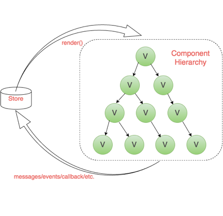

::: tip
redux 浅读
:::

## Redux是JavaScript状态容器，能提供可预测化的状态管理。

## 为什么要用Redux？

+ 前端复杂性的根本原因是大量无规律的交互和异步操作。
+ 变化和异步操作的相同作用都是改变了当前View的状态，但是它们的无规律性导致了前端的复杂，而且随着代码量越来越大，我们要维护的状态也越来越多。
  

页面比较复杂，又没有用任何数据层框架的话，就是图片上这个样子：交互上存在父子、子父、兄弟组件间通信，数据也存在跨层、反向的数据流。

+ 理想的应用状态

redux本身有哪些作用？我们先来快速的过一下redux的核心思想（工作流程）：

将状态统一放在一个state中，由store来管理这个state
这个store按照reducer的“shape”（形状）创建。
reducer的作用是接收到view发出的action后，输出一个新的状态，对应地更新store上的状态。
根据redux的原则指导，外部改变state的最佳方式是通过调用store的dispatch方法，触发一个action，这个action被对应的reducer处理，完成state更新。
可以通过subscribe在store上添加一个监听函数。每当调用dispatch方法时，会执行所有的监听函数。
可以添加中间件（中间件是干什么的我们后面讲）处理副作用。

在这个工作流程中，redux需要提供的功能是：

创建store，即：createStore()
创建出来的store提供subscribe，dispatch，getState这些方法。
将多个reducer合并为一个reducer，即：combineReducers()
应用中间件，即applyMiddleware()

架构层面上讲，我们希望UI跟数据和逻辑分离，UI只负责渲染，业务和逻辑交由其它部分处理，从数据流向方面来说, 单向数据流确保了整个流程清晰。

我们之前的操作可以复制、追踪出来，这也是Redux的主要设计思想。

## 综上，Redux可以做到：

+ 每个State变化可预测。
+ 动作与状态统一管理。
