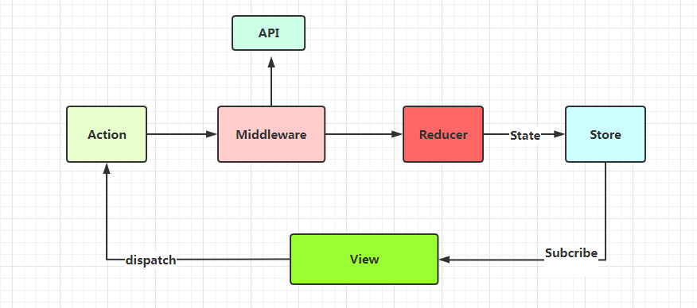
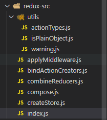

::: tip
redux工作原理
:::

## 一起剥析redux工作原理、逐行解读redux源码

> 本文不讲基本使用，讲讲redux的工作原理、和自己的阅读源码的体验

+ 首先看下Redux的工作原理
  + 核心就是发布订阅
  + 当要使用时，就订阅的store的更新行为,store更新后，触发回调，重新获取最新内容，达到实时更新



1. 当触发某个行为时，执行store.dispatch(action)
2. 通过reducer重新生成新的state，返回给store
3. 通过store.subscribe()执行订阅回调，页面重新执行setState，触发页面更新

+ 接下来将逐个讲解函数

  + 先看源码目录结构,redux源码不多，阅读体验相对较好;

    
  + 首先入场的是我们的createStore函数,先看一下源码实现：

    ```jsx
    //使用时是这样的
    const store = createStore(reducer, { age: 18,userName: "init 爱华" }, applyMiddleware(logger))

    //第一个参数reducer，第二个参数是初始状态,默认值的意思，第三个参数是中间件
    export default function createStore(reducer, preloadedState, enhancer) {
      //两个参数情况，只传reducer、中间件
      if (typeof preloadedState === 'function' && typeof enhancer === 'undefined') {
        enhancer = preloadedState
        preloadedState = undefined
      }

      if (typeof enhancer !== 'undefined') {
        if (typeof enhancer !== 'function') {
          throw new Error('Expected the enhancer to be a function.')
        }
        //有中间件,执行中间件返回后的函数，在把createStore函数传入执行，返回一系列函数，和新的改造后的dispatch函数，下面会讲到中间件实现
        return enhancer(createStore)(reducer, preloadedState)
      }

      if (typeof reducer !== 'function') {
        throw new Error('Expected the reducer to be a function.')
      }
       // 初始化值
      let currentReducer = reducer
      let currentState = preloadedState
      let currentListeners = []
      let nextListeners = currentListeners
      let isDispatching = false
    // currentListeners
    // nextListeners
    // 订阅和取消订阅操作并不会立刻生效，而是等到下一次
      function ensureCanMutateNextListeners() {
        if (nextListeners === currentListeners) {
          nextListeners = currentListeners.slice()
        }
      }
      //......  
      //初始化state
      dispatch({ type: ActionTypes.INIT })

      return {
        dispatch,
        subscribe,
        getState,
        replaceReducer,
        [$$observable]: observable
      }  
    }
    ```
  + getState函数,返回当前的state

    ```jsx
      /**
       * Reads the state tree managed by the store.
       * @returns {any} The current state tree of your application.
       */
      function getState() {
        if (isDispatching) {
          throw new Error(
          )
        }

        return currentState
      }
    ```
  + dispatch函数 ,执行reducer生成新的state，遍历执行订阅函数，返回传入的action

    ```js
      function dispatch(action) {
        //判断传入的action是否合法
        if (!isPlainObject(action)) {
          throw new Error(
          )
        }
        if (typeof action.type === 'undefined') {
          throw new Error(
          )
        }
        if (isDispatching) {
          throw new Error('Reducers may not dispatch actions.')
        }
        try {
          isDispatching = true
            //执行reducer，生成新的state
          currentState = currentReducer(currentState, action)
        } finally {
          isDispatching = false
        }
           //遍历执行回调
        const listeners = (currentListeners = nextListeners)
        for (let i = 0; i < listeners.length; i++) {
          const listener = listeners[i]
          listener()
        }

        return action
      }

    ```
  + subscribe函数,订阅回调

    + 把函数加到nextListeners数组中，等待执行

    ```jsx
      function subscribe(listener) {
        if (typeof listener !== 'function') {
          throw new Error('Expected the listener to be a function.')
        }
        if (isDispatching) {
          throw new Error(
          )
        }
        let isSubscribed = true
        ensureCanMutateNextListeners()
        nextListeners.push(listener)
          //返回删除一个函数，以便清除回调
        return function unsubscribe() {
          if (!isSubscribed) {
            return
          }
          if (isDispatching) {
            throw new Error(
            )
          }
          isSubscribed = false
          ensureCanMutateNextListeners()
          const index = nextListeners.indexOf(listener)
          nextListeners.splice(index, 1)
        }
      }
    ```
  + replaceReducer函数，动态替换reducer函数，

    ```jsx
      function replaceReducer(nextReducer) {
        if (typeof nextReducer !== 'function') {
          throw new Error('Expected the nextReducer to be a function.')
        }

        currentReducer = nextReducer
        dispatch({ type: ActionTypes.REPLACE })
      }
    ```
  + compose函数,组合函数，用reduce实现

    ```jsx
    export default function compose(...funcs) {
      if (funcs.length === 0) {
        return arg => arg
      }

      if (funcs.length === 1) {
        return funcs[0]
      }

      return funcs.reduce((a, b) => {
        return  (...args) => a(b(...args))
      })
    }

    ```
  + applyMiddleware函数

    ```jsx

    // chunk中间件的实现
    function createThunkMiddleware(extraArgument) {
      return ({ dispatch, getState }) => (next) => (action) => {
        if (typeof action === 'function') {
          return action(dispatch, getState, extraArgument);
        }
        return next(action);
      };
    }
    const thunk = createThunkMiddleware();
    export default thunk;

    export default function applyMiddleware(...middlewares) {
      // 返回新函数,接受一个createStore函数
      return createStore => (...args) => {
        //执行createStore
        const store = createStore(...args)

        let dispatch = () => {
          throw new Error()
        }
        //中间件可以拿到老的state的值，以及更新的action
        const middlewareAPI = {
          getState: store.getState,
          dispatch: (...args) => dispatch(...args)
        }
        //把中间件执行生成新的函数,这个比较难理解
        const chain = middlewares.map(middleware => middleware(middlewareAPI))
        dispatch = compose(...chain)(store.dispatch)

        //只有单个中间件的时候
        //middleware(middlewareAPI)(store.dispatch)(action)
        //多个中间件
        // (...args) => a(b(...args))
        return {
          ...store,
          dispatch
        }
      }
    }

    ```
    + combineReducers函数

      ```jsx
      export default function combineReducers(reducers) {
        /**
         * count: ()=>0,
         * user:()=>{}  
         */
        const reducerKeys = Object.keys(reducers)
        //保存正确的reducer
        const finalReducers = {}
        for (let i = 0; i < reducerKeys.length; i++) {
          const key = reducerKeys[i]   //方法的key值

          if (process.env.NODE_ENV !== 'production') {
            if (typeof reducers[key] === 'undefined') {
              warning(`No reducer provided for key "${key}"`)
            }
          }
          //正确的reducer
          if (typeof reducers[key] === 'function') {
            finalReducers[key] = reducers[key]
          }
        }
        //reducer集合
        const finalReducerKeys = Object.keys(finalReducers)

        let unexpectedKeyCache
        if (process.env.NODE_ENV !== 'production') {
          unexpectedKeyCache = {}
        }
        //判断initState是否符合规范
        let shapeAssertionError
        try {
          assertReducerShape(finalReducers)
        } catch (e) {
          shapeAssertionError = e
        }

        return function combination(state = {}, action) {
          if (shapeAssertionError) {
            throw shapeAssertionError
          }

          if (process.env.NODE_ENV !== 'production') {
            const warningMessage = getUnexpectedStateShapeWarningMessage(
              state,
              finalReducers,
              action,
              unexpectedKeyCache
            )
            if (warningMessage) {
              warning(warningMessage)
            }
          }

          let hasChanged = false
          const nextState = {}
          for (let i = 0; i < finalReducerKeys.length; i++) {
            //当前reducer的key
            const key = finalReducerKeys[i]
            //当前reducer的key对应的方法
            const reducer = finalReducers[key]
            //获取初始值
            const previousStateForKey = state[key]
            //执行reducer生成新的state
            const nextStateForKey = reducer(previousStateForKey, action)

            //判断值是否符合规范
            if (typeof nextStateForKey === 'undefined') {
              const errorMessage = getUndefinedStateErrorMessage(key, action)
              throw new Error(errorMessage)
            }
            nextState[key] = nextStateForKey
            //判断新老state是否相等
            hasChanged = hasChanged || nextStateForKey !== previousStateForKey
          }
          //返回最新的state
          return hasChanged ? nextState : state
        }
      }

      ```
